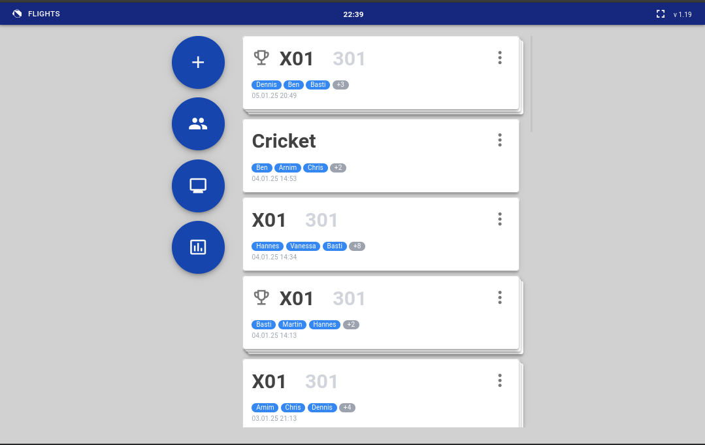
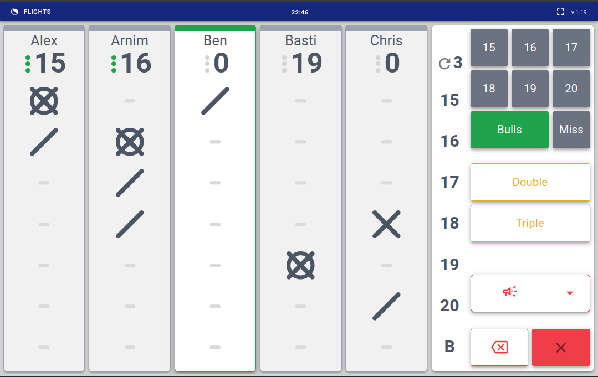
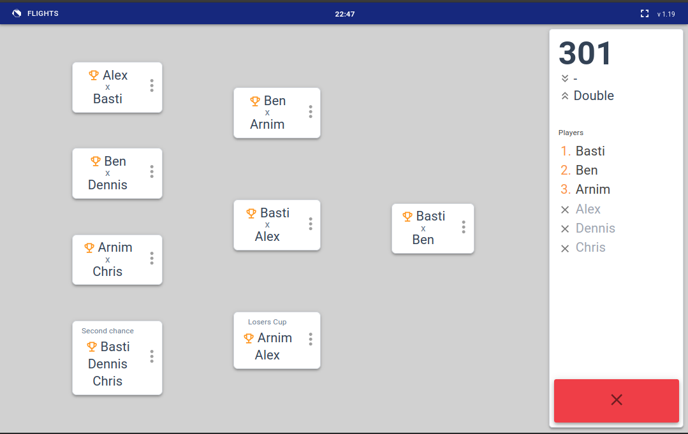

# Flights
Simple game- and tournament calculate for Darts matches

## Features

Currently four game types:
- X01
- Cricket
- Cut-Throat Cricket
- Around the Clock

All types may be played as single game or in a tournament.  
Customizable winner jingles and in-game sound effects.  
Viewer mode for secondary spectator display

## Deployment

Designed to run as docker container. Checkout repository,  
then from repo-root
> docker compose up -d  

then browse to  

>localhost:8080

Note 1: per default port 8080 is used to map to the container.  
Change docker-compose.yaml if necessary  
Note 2: docker-compose.yaml applies custom timezone!  

## Hardware
Designed to work on a RaspberryPi 4 (4gig version) with a  
10"/1280x800 touch-display. Since I suck at UI, the frontend  
is somewhat hard-wired for that resolution as of now.

